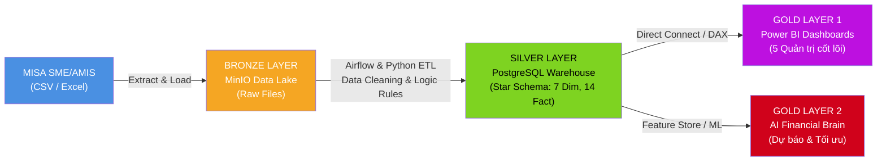

# 📽️ BẢN THUYẾT TRÌNH DỰ ÁN GỖ MINH LONG
## Hệ thống Phân tích Dữ liệu, Báo cáo Quản trị BI & Tối ưu hóa Tài chính Thông minh (AI Financial Brain)

---

## 📌 THÔNG TIN CHUNG
- **Đề tài:** Ứng dụng Kỹ nghệ Dữ liệu (Data Engineering), Business Intelligence & Trí tuệ Nhân tạo (Machine Learning) trong Quản trị Vận hành & Tối ưu hóa Tài chính Doanh nghiệp Gỗ Minh Long
- **Đối tượng trình bày:** Ban Giám đốc (BOD), Giám đốc Tài chính (CFO), Hội đồng Thẩm định Dự án
- **Thời lượng dự kiến:** 15 – 20 phút thuyết trình + 10 phút Q&A
- **Quy chuẩn Slide:** Cấu trúc 14 Slide hoàn chỉnh kèm **Lời thoại thuyết trình (Speaker Notes)** chi tiết.

---

### SLIDE 1: MÀN HÌNH CHÀO & TỔNG QUAN DỰ ÁN
**Tiêu đề:** HỆ THỐNG PHÂN TÍCH DỮ LIỆU & QUẢN TRỊ TÀI CHÍNH THÔNG MINH — GỖ MINH LONG  
**Phụ đề:** Từ Dữ liệu Kế toán phân tán đến Trung tâm Điều hành Tài chính Thông minh (AI Financial Brain)  
**Người trình bày:** Đội ngũ Dự án Data & AI — Gỗ Minh Long  

* **Nội dung hiển thị trên Slide:**
  - **Logo Gỗ Minh Long** & Biểu tượng Chuyển đổi số.
  - **3 Trụ cột cốt lõi:**
    1. *Data Engineering:* Chuẩn hóa dữ liệu thô (MISA) thành Data Warehouse Star Schema đạt độ chính xác 100%.
    2. *Business Intelligence:* 5 Dashboard Quản trị chuyên sâu (Nợ, Kho, Công nợ, Thanh khoản, Dòng tiền).
    3. *AI/ML Optimization:* Dự báo Dòng tiền & Tối ưu hóa Thanh khoản - Chi phí vốn (CFO AI Brain).

> 🎙️ **Lời thoại thuyết trình (Speaker Notes):**  
> *"Kính thưa Ban Giám đốc và quý Hội đồng,  
> Trong bối cảnh ngành sản xuất gỗ công nghiệp đang đối mặt với nhiều biến động về chi phí nguyên vật liệu, áp lực công nợ khách hàng và chi phí vốn ngân hàng, việc ra quyết định dựa trên cảm tính hay các báo cáo Excel chậm trễ không còn đủ sức cạnh tranh. Hôm nay, chúng tôi xin trân trọng giới thiệu dự án: **'Hệ thống Phân tích Dữ liệu và Quản trị Tài chính Thông minh cho Gỗ Minh Long'**. Dự án này không chỉ đơn thuần là trực quan hóa báo cáo, mà là một bước chuyển mình toàn diện từ 'Báo cáo bị động' sang 'Dự báo và Hành động tối ưu bằng Trí tuệ Nhân tạo'."*

---

### SLIDE 2: BỐI CẢNH DOANH NGHIỆP & CÁC NỖI ĐAU CẦN GIẢI QUYẾT (PAIN POINTS)
**Tiêu đề:** THỰC TRẠNG QUẢN TRỊ TRƯỚC DỰ ÁN: NHỮNG "NÚT THẮT" SINH TỬ  
**Thông điệp chính:** Dữ liệu phân tán, báo cáo thủ công gây độ trễ thông tin lớn và rủi ro thanh khoản tiềm ẩn.

* **Nội dung hiển thị trên Slide:**
  - **Pain Point 1: Excel thủ công & Rời rạc:** Kế toán mất 3 - 5 ngày sau khi kết thúc tháng mới tổng hợp xong báo cáo. Ban lãnh đạo luôn phải "nhìn qua kính chiếu hậu" để điều hành.
  - **Pain Point 2: Nhiễu giao dịch ảo & Dư nợ lệch:**
    - Giao dịch chuyển tiền nội bộ (`CTNB`) làm phồng ảo doanh số dòng tiền hàng chục tỷ đồng.
    - File khế ước vay (`fact_loan`) nhập tay thường xuyên vênh số dư với thực tế ngân hàng.
  - **Pain Point 3: Bẫy cộng dồn BCTC (Semi-additive Error):** Các báo cáo cũ cộng dồn số dư tiền và tồn kho qua các tháng, khiến số liệu sai lệch gấp 3-12 lần.
  - **Pain Point 4: Bài toán Vốn & Chi phí lãi vay:** Tồn kho đọng vốn, khách hàng chậm trả dẫn đến doanh nghiệp phải liên tục vay vốn lưu động, chi phí lãi vay (TK 635) bào mòn biên lợi nhuận.

> 🎙️ **Lời thoại thuyết trình (Speaker Notes):**  
> *"Trước khi triển khai dự án, chúng tôi đã khảo sát sâu sắc quy trình vận hành tại Gỗ Minh Long và phát hiện 4 nút thắt lớn:  
> Thứ nhất, báo cáo hoàn toàn phụ thuộc vào các file Excel nhập tay, khiến CFO nhận báo cáo với độ trễ từ 3 đến 5 ngày.  
> Thứ hai, trong sổ cái kế toán MISA xuất hiện rất nhiều bút toán chuyển tiền qua lại giữa các tài khoản ngân hàng nội bộ. Nếu cộng dồn máy móc, dòng tiền sẽ bị 'thổi phồng ảo'. Đồng thời, việc theo dõi nợ vay ngân hàng qua file Excel nhập tay dẫn đến sự sai lệch nghiêm trọng với ngân hàng.  
> Thứ ba, lỗi kỹ thuật về tính chất bán cộng dồn của Bảng cân đối kế toán khiến việc xem dữ liệu theo quý, theo năm bị sai hoàn toàn.  
> Và cuối cùng là bài toán sống còn: Hàng trăm tỷ đồng đang bị kẹt giữa hàng tồn kho và nợ đọng đại lý, buộc công ty phải gánh chi phí lãi vay ngân hàng rất lớn. Đây là những lý do thôi thúc chúng tôi xây dựng một giải pháp công nghệ căn cơ."*

---

### SLIDE 3: KIẾN TRÚC TỔNG THỂ HỆ THỐNG (DATA ARCHITECTURE)
**Tiêu đề:** KIẾN TRÚC DỮ LIỆU CHUẨN MEDALLION: TỪ DỮ LIỆU THÔ ĐẾN SINGLE SOURCE OF TRUTH  
**Thông điệp chính:** Đảm bảo dữ liệu được làm sạch triệt để, có thể truy vết và đạt độ chính xác 100%.

* **Nội dung hiển thị trên Slide:**


* **Điểm đột phá kỹ thuật:**
  - **PostgreSQL Data Warehouse:** Đóng vai trò là Nguồn chân lý duy nhất (Single Source of Truth), thay thế hoàn toàn việc đọc trực tiếp file Excel thủ công.
  - **Tự động hóa luồng ETL:** Xử lý triệt để chứng từ `CTNB`, áp dụng logic cửa sổ (`ROW_NUMBER`) để tính toán dư nợ chính xác từng giây.
  - **Mô hình Star Schema:** Tách biệt rõ ràng 7 bảng Chiều (Dim) và 14 bảng Sự kiện (Fact), giúp tốc độ truy vấn trên Power BI và huấn luyện mô hình AI diễn ra tức thì.

> 🎙️ **Lời thoại thuyết trình (Speaker Notes):**  
> *"Để giải quyết tận gốc vấn đề dữ liệu, chúng tôi xây dựng kiến trúc Medallion 3 tầng theo tiêu chuẩn doanh nghiệp quốc tế:  
> Tầng Bronze lưu trữ nguyên vẹn dữ liệu thô xuất từ MISA lên Data Lake.  
> Tầng Silver là trái tim của hệ thống: Kho dữ liệu PostgreSQL. Tại đây, các script ETL Python và Airflow tự động lọc bỏ giao dịch ảo CTNB, loại bỏ file nhập tay thủ công và tổ chức dữ liệu theo mô hình Star Schema chuẩn gồm 7 bảng Dim và 14 bảng Fact. Dữ liệu tại đây đã vượt qua các kỳ kiểm thử SIT/UAT khắt khe với độ chính xác đạt 100%.  
> Từ tầng Silver chuẩn xác này, chúng tôi nuôi dưỡng hai nhánh giá trị ở tầng Gold: Một là hệ thống 5 Dashboard Power BI cho lãnh đạo theo dõi hàng ngày, và hai là Trung tâm Trí tuệ Nhân tạo AI Brain để dự báo và tối ưu hóa."*

---

### SLIDE 4: TRỤ CỘT BI 1 — DASHBOARD QUẢN TRỊ TÀI CHÍNH & CẤU TRÚC NỢ
**Tiêu đề:** DASHBOARD 1: QUẢN TRỊ TÍN DỤNG, CHI PHÍ VỐN & ĐÒN BẨY NỢ  
**Thông điệp chính:** Minh bạch hóa từng đồng nợ vay, bảo toàn hạn mức tín dụng và kiểm soát chi phí lãi.

* **Nội dung hiển thị trên Slide:**
  - **Các chỉ số điều hành trực quan:**
    - *Dư nợ ngắn hạn (TK 34111, 34113, 34114):* Theo dõi nợ vay bổ sung vốn lưu động từng ngân hàng.
    - *Dư nợ dài hạn (TK 34112):* Theo dõi nguồn vốn đầu tư máy móc, dây chuyền xưởng.
    - *Room tín dụng khả dụng (Hạn mức còn lại):* Cảnh báo ngay khi hạn mức vay chạm ngưỡng đỏ.
    - *Tỷ lệ tài sản bảo đảm (LTV) & Hệ số chi trả lãi vay (ISR):* Đánh giá sức khỏe tài chính trước các ngân hàng đối tác.
  - **Đột phá kỹ thuật:** Xóa bỏ bảng `fact_loan` nhập tay, tự động tính dư nợ theo thời gian thực từ sổ cái `fact_cashflow` bằng thuật toán cửa sổ SQL.

> 🎙️ **Lời thoại thuyết trình (Speaker Notes):**  
> *"Báo cáo đầu tiên là Dashboard Quản trị Hoạt động Tài chính.  
> Trước đây, CFO muốn biết công ty đang nợ ngân hàng nào bao nhiêu tiền, còn vay thêm được bao nhiêu thì phải gọi kế toán rà soát lại từng hợp đồng tín dụng. Giờ đây, chỉ cần 1 cú click chuột, Dashboard hiển thị tức thì: Dư nợ ngắn hạn, dài hạn, Room tín dụng còn lại của từng ngân hàng (VietinBank, BIDV, Techcombank,...), và hệ số an toàn lãi vay ISR.  
> Đặc biệt, toàn bộ số liệu nợ vay được móc trực tiếp từ Sổ cái dòng tiền ngân hàng, loại bỏ 100% rủi ro nhập sai của con người."*

---

### SLIDE 5: TRỤ CỘT BI 2 — DASHBOARD QUẢN TRỊ HÀNG TỒN KHO
**Tiêu đề:** DASHBOARD 2: GIẢI PHÓNG DÒNG TIỀN ĐANG "NGỦ QUÊN" TRONG KHO  
**Thông điệp chính:** Kiểm soát chính xác Nhập - Xuất - Tồn, giảm ngày lưu kho DIO và chống đọng vốn.

* **Nội dung hiển thị trên Slide:**
  - **Các chỉ số điều hành trực quan:**
    - *Giá trị tồn kho chốt cuối kỳ:* Phân lớp chi tiết theo Ván dăm MFC, Ván MDF, Ván Plywood, Giấy Melamine và Hóa chất phụ gia.
    - *Số ngày luân chuyển tồn kho (DIO):* Đo lường tốc độ quay vòng của từng nhóm hàng hóa.
    - *Cảnh báo Tồn kho an toàn (Safety Stock):* Ngăn chặn rủi ro đứt gãy dây chuyền ép dán phủ bề mặt.
    - *Phân tích Tồn kho chậm luân chuyển (>90 ngày, >180 ngày):* Khoanh vùng chính xác các lô hàng cũ để Ban Giám đốc lên chiến dịch xả hàng thu hồi tiền mặt.
  - **Đột phá kỹ thuật:** Ứng dụng DAX Semi-additive với bộ lọc `MAX Date`, bảo đảm số dư tồn kho không bị cộng dồn sai khi lọc theo quý/năm.

> 🎙️ **Lời thoại thuyết trình (Speaker Notes):**  
> *"Dashboard số 2 là Quản trị Hàng tồn kho.  
> Trong ngành gỗ, 'Hàng tồn kho chính là Tiền mặt đang nằm ngủ'. Nếu để tồn kho quá nhiều, tiền bị chôn một chỗ và chịu chi phí kho bãi, hao hụt; nếu tồn kho quá ít, xưởng sản xuất phải dừng máy chờ nguyên liệu.  
> Dashboard này giúp Ban Giám đốc nhìn rõ: Giá trị tồn kho thực tế của từng loại ván, số ngày quay vòng tồn kho DIO, và đặc biệt là hệ thống tự động bôi đỏ cảnh báo những mã hàng đã nằm chết trong kho trên 90 ngày. Đây là cơ sở vàng để công ty giải phóng hàng chục tỷ đồng vốn đọng."*

---

### SLIDE 6: TRỤ CỘT BI 3 — DASHBOARD QUẢN TRỊ PHẢI THU & PHẢI TRẢ
**Tiêu đề:** DASHBOARD 3: TỐI ƯU HÓA CÔNG NỢ & NGĂN NGỪA NỢ XẤU ĐẠI LÝ  
**Thông điệp chính:** Rút ngắn số ngày thu nợ DSO, kéo dài hợp lý số ngày trả nợ DPO, giữ vững dòng máu tài chính.

* **Nội dung hiển thị trên Slide:**
  - **Các chỉ số điều hành trực quan:**
    - *Số ngày thu nợ bình quân (DSO):* Đánh giá hiệu quả đòi tiền từ hệ thống đại lý và nhà thầu nội thất.
    - *Số ngày trả nợ người bán (DPO):* Tận dụng tối đa thời gian chiếm dụng vốn hợp pháp từ nhà cung cấp keo, ván thô.
    - *Ma trận phân tích tuổi nợ (Aging Buckets):* Tự động phân loại: Trong hạn, Quá hạn 1-30 ngày, 31-60 ngày, 61-90 ngày và Trên 90 ngày.
    - *Top đối tác rủi ro cao:* Cảnh báo danh sách các khách hàng nợ vượt hạn mức tín dụng thương mại để phòng kinh doanh tạm ngưng cấp hàng mới.

> 🎙️ **Lời thoại thuyết trình (Speaker Notes):**  
> *"Tiếp theo là Dashboard Quản trị Phải thu - Phải trả.  
> Công nợ là 'Tiền của mình nhưng đang nằm trong túi người khác'. Tại Gỗ Minh Long, khách hàng gồm rất nhiều đại lý và xưởng mộc, rủi ro chiếm dụng vốn là rất cao.  
> Dashboard 3 cung cấp cho bộ phận Kinh doanh và Thu hồi nợ một bức tranh trực quan: Ai đang nợ, nợ bao lâu, đã quá hạn bao nhiêu ngày. Hệ thống tính toán chỉ số DSO chuẩn xác theo từng khoảng thời gian linh hoạt (bằng biến động DaysInPeriod), giúp loại bỏ lỗi tính toán hàng nghìn ngày của các hệ thống cũ, tạo đòn bẩy đàm phán công nợ mạnh mẽ."*

---

### SLIDE 7: TRỤ CỘT BI 4 & 5 — THANH KHOẢN, TIỀN GỬI & DÒNG TIỀN (CASHFLOW)
**Tiêu đề:** DASHBOARD 4 & 5: ĐẢM BẢO AN TOÀN THANH KHOẢN & ĐIỀU HÒA DÒNG TIỀN  
**Thông điệp chính:** Kiểm soát luồng tiền vào - ra thực tế, theo dõi Runway và tối ưu hóa lợi suất tiền gửi.

* **Nội dung hiển thị trên Slide:**
  - **Dashboard 4 - Tiền gửi & An toàn Thanh khoản:**
    - *Hệ số thanh toán hiện hành (Current Ratio) & Thanh toán nhanh (Quick Ratio).*
    - *Thời gian sinh tồn của tiền mặt (Cash Runway):* Đo lường số tháng công ty có thể vận hành ổn định nếu doanh thu đột ngột gián đoạn.
    - *Quản trị danh mục Hợp đồng tiền gửi:* Theo dõi lãi suất, ngày đáo hạn các sổ tiết kiệm ngắn hạn để sẵn sàng xoay vòng vốn.
  - **Dashboard 5 - Dòng tiền (Cashflow Master):**
    - *Dòng tiền vào - Dòng tiền ra - Dòng tiền thuần (Net Cashflow) theo ngày/tuần/tháng.*
    - *Phân loại theo hoạt động Kinh doanh - Đầu tư - Tài chính (VAS).*
    - *So sánh Thực tế vs Kế hoạch ngân sách (Variance Analysis):* Cảnh báo ngay tức khắc các khoản chi vượt ngân sách dự toán.

> 🎙️ **Lời thoại thuyết trình (Speaker Notes):**  
> *"Hai Dashboard cuối cùng trong bộ báo cáo BI là Tiền gửi - Thanh khoản và Dòng tiền.  
> Doanh nghiệp có thể báo cáo lãi lớn trên sổ sách kế toán nhưng vẫn có thể đứng trước nguy cơ phá sản nếu cạn kiệt tiền mặt thanh toán.  
> Dashboard 4 và 5 giúp CFO giám sát từng đồng tiền thực tế đang nằm ở ngân hàng nào, hệ số thanh toán nhanh là bao nhiêu, và Cash Runway còn trụ được mấy tháng. Toàn bộ dòng tiền chuyển nội bộ CTNB đã được lọc sạch, mang lại một báo cáo dòng tiền thuần trung thực, minh bạch tuyệt đối."*

---

### SLIDE 8: BƯỚC ĐỘT PHÁ CHIẾN LƯỢC — TỪ BI SANG AI FINANCIAL BRAIN
**Tiêu đề:** NÂNG CẤP CHIẾN LƯỢC: CHUYỂN DỊCH TỪ "NHÌN LẠI QUÁ KHỨ" SANG "DỰ BÁO TƯƠNG LAI"  
**Thông điệp chính:** BI trả lời câu hỏi "Chuyện gì đã xảy ra?" — AI Brain trả lời "Chuyện gì sắp xảy ra và nên làm gì để tối ưu chi phí?"

* **Nội dung hiển thị trên Slide:**
  - **Thang đo mức độ trưởng thành phân tích dữ liệu (Analytics Maturity):**
    1. *Descriptive (Mô tả):* BI Dashboard cho thấy Dư nợ hiện tại là 80 tỷ, Tồn kho là 120 tỷ.
    2. *Predictive (Dự báo):* AI dự báo trong 4 tuần tới dòng tiền sẽ âm 15 tỷ do đến hạn trả tiền nhà cung cấp.
    3. *Prescriptive (Chỉ định tối ưu):* AI khuyến nghị: *"Ngày 15 giải ngân 10 tỷ từ VietinBank (lãi suất 7.2%), rút sổ tiết kiệm 5 tỷ từ BIDV, không giải ngân Techcombank vì lãi suất cao hơn (7.8%)"*.
  - **Sợi dây liên kết Chu kỳ Chuyển hóa Tiền (Cash Conversion Cycle - CCC):**
    $$\text{CCC} = \text{DIO (Tồn kho)} + \text{DSO (Công nợ)} - \text{DPO (Phải trả)}$$

> 🎙️ **Lời thoại thuyết trình (Speaker Notes):**  
> *"Kính thưa Ban Giám đốc,  
> Nếu chúng ta chỉ dừng lại ở 5 Dashboard Power BI, hệ thống mới chỉ hoàn thành nhiệm vụ 'Phân tích mô tả' (Descriptive Analytics) – tức là nhìn lại những gì đã xảy ra. Nhưng mục tiêu tối thượng của ban lãnh đạo là nhìn về tương lai để ra quyết định chủ động.  
> Vì vậy, chúng tôi đã phát triển tầng thứ hai: **AI Financial Brain - Bộ não Tài chính AI**.  
> Sức mạnh cốt lõi ở đây là: Công nợ, Tồn kho và Dòng tiền không tồn tại tách rời nhau, mà được xâu chuỗi thông qua Chu kỳ Chuyển hóa Tiền CCC. Tối ưu tồn kho và kiểm soát công nợ chính là đầu vào để giải quyết bài toán lớn nhất: Tối ưu hóa Thanh khoản và Vốn vay."*

---

### SLIDE 9: KIẾN TRÚC BỘ NÃO TỐI ƯU HÓA THANH KHOẢN (LIQUIDITY OPTIMIZER)
**Tiêu đề:** BÀI TOÁN TỐI ƯU HÓA THANH KHOẢN & CHI PHÍ LÃI VAY (MILP FRAMEWORK)  
**Thông điệp chính:** Thuật toán toán học quy hoạch tuyến tính (MILP) điều phối thông minh giữa Vốn vay và Tiền gửi.

* **Nội dung hiển thị trên Slide:**
```
  [NHÓM ĐẦU VÀO ML UPSTREAM]                      [DỮ LIỆU RÀNG BUỘC THỰC TẾ]
┌──────────────────────────────┐                ┌───────────────────────────────┐
│ AI Tối ưu Tồn kho            │                │ bc_tin_dung_2026.xlsx         │
│ (Giải phóng vốn đọng)         │                │ (Hạn mức & Lãi suất từng NH)  │
├──────────────────────────────┤                ├───────────────────────────────┤
│ AI Chấm điểm Nợ AR           │                │ Hop_dong_tien_gui.xlsm        │
│ (Dự báo rủi ro trễ tiền)     │                │ (Kỳ hạn & Lãi tiền gửi)       │
├──────────────────────────────┤                ├───────────────────────────────┤
│ ML Dự báo Dòng tiền          │                │ Ngưỡng Cash Buffer tối thiểu  │
│ (Net Cashflow T+1 đến T+4)   │                │ (Bảo đảm an toàn ngân quỹ)    │
└──────────────┬───────────────┘                └───────────────┬───────────────┘
               │                                                │
               └───────────────────────┬────────────────────────┘
                                       ▼
                       ┌───────────────────────────────┐
                       │   LIQUIDITY OPTIMIZER (MILP)  │
                       │   Minimize: Net Interest Cost │
                       └───────────────┬───────────────┘
                                       ▼
                       ┌───────────────────────────────┐
                       │    HÀNH ĐỘNG ĐỀ XUẤT CHO CFO  │
                       │  - Vay bao nhiêu? Ở đâu?      │
                       │  - Gửi bao nhiêu? Kỳ hạn nào? │
                       └───────────────────────────────┘
```

* **Mục tiêu tối ưu hóa:** Giảm thiểu tối đa Chi phí Lãi vay ròng (Net Interest Expense = Lãi vay phải trả - Lãi tiền gửi thu được).

> 🎙️ **Lời thoại thuyết trình (Speaker Notes):**  
> *"Slide này thể hiện bài toán tinh hoa nhất của dự án: Liquidity Optimizer.  
> Trong thực tế, Gỗ Minh Long vừa có hợp đồng vay vốn tại nhiều ngân hàng với các mức lãi suất khác nhau, lại vừa có các hợp đồng tiền gửi tiết kiệm có kỳ hạn.  
> Làm thế nào để CFO biết: Khi có khoản tiền nhàn rỗi trong 20 ngày, nên gửi tiết kiệm kỳ hạn nào để sinh lời cao nhất mà không bị phạt khi rút? Hoặc khi thiếu hụt tiền mặt, nên giải ngân từ ngân hàng nào, khế ước nào để chịu lãi suất thấp nhất?  
> Thuật toán Quy hoạch tuyến tính hỗn hợp nguyên (MILP) của chúng tôi nhận đầu vào từ 3 mô hình dự báo dòng tiền, kết hợp các ràng buộc thực tế từ bảng tín dụng và hợp đồng tiền gửi để tự động đưa ra phương án tài chính tối ưu nhất."*

---

### SLIDE 10: CHI TIẾT 3 MÔ HÌNH MACHINE LEARNING BỔ TRỢ
**Tiêu đề:** 3 MÔ HÌNH HỌC MÁY (ML) CUNG CẤP ĐẦU VÀO THỜI GIAN THỰC  
**Thông điệp chính:** Độ chính xác của bài toán tối ưu phụ thuộc vào sức mạnh của các mô hình dự báo chuyên sâu.

* **Nội dung hiển thị trên Slide:**
  - **Mô hình 1: Dự báo Dòng tiền (Cashflow Forecasting - XGBoost & Prophet):**
    - Dự báo luồng thu/chi ròng trong 4 – 12 tuần tới.
    - Học được tính chu kỳ mùa vụ của ngành gỗ (cao điểm hoàn thiện công trình quý 3 - 4, thấp điểm tháng Giêng).
  - **Mô hình 2: Phân loại Rủi ro Công nợ (AR Risk Classification - Random Forest / XGBoost):**
    - Chấm điểm tín dụng cho từng đối tác dựa trên hành vi trả nợ trong quá khứ.
    - Dự báo xác suất trễ hạn trên 30 ngày để bộ phận tài chính chủ động phương án bù đắp dòng tiền.
  - **Mô hình 3: Dự báo Nhu cầu & Tồn kho An toàn (Inventory Demand Forecasting):**
    - Tính toán điểm đặt hàng lại (Reorder Point - ROP) và mức tồn kho an toàn cho từng quy cách ván và phụ liệu.
    - Giảm 15 - 25% lượng vốn chết mà không lo gián đoạn giao hàng.

> 🎙️ **Lời thoại thuyết trình (Speaker Notes):**  
> *"Để cung cấp đầu vào chuẩn xác cho cỗ máy tối ưu hóa thanh khoản, chúng tôi triển khai 3 mô hình Machine Learning chuyên biệt:  
> Thứ nhất là mô hình Dự báo Dòng tiền kết hợp giữa thuật toán học tăng cường XGBoost và Facebook Prophet, giúp dự báo chính xác dòng tiền vào-ra mỗi tuần.  
> Thứ hai là mô hình Chấm điểm rủi ro công nợ khách hàng, giúp nhận diện sớm đại lý nào có khả năng trả chậm để CFO không bị 'bất ngờ' về nguồn thu.  
> Và thứ ba là mô hình Dự báo nhu cầu vật tư, tính toán chính xác lượng ván dăm và hóa chất cần mua vừa đủ cho sản xuất, giải phóng vốn lưu động tối đa."*

---

### SLIDE 11: TRỢ LÝ DOANH NGHIỆP THÔNG MINH (AI BUSINESS ASSISTANT)
**Tiêu đề:** AI BUSINESS ASSISTANT: TRỢ LÝ ẢO HỎI ĐÁP TÀI CHÍNH TỰ ĐỘNG (RAG & TEXT-TO-SQL)  
**Thông điệp chính:** Dân chủ hóa dữ liệu — Ban Lãnh đạo có thể truy vấn số liệu tài chính phức tạp bằng giọng nói/văn bản tự nhiên.

* **Nội dung hiển thị trên Slide:**
  - **Cơ chế hoạt động:** Kết hợp Mô hình Ngôn ngữ lớn (LLM), kỹ thuật RAG (Retrieval-Augmented Generation) và sinh câu lệnh SQL an toàn (Text-to-SQL).
  - **Khả năng tương tác thực tế:**
    - *Câu hỏi:* "Tuần tới công ty có khoản vay nào đến hạn không và ngân hàng nào còn hạn mức vay lớn nhất?"
    - *AI xử lý:* Tự động quét `fact_cashflow`, `fact_creditlimitsummary` trong PostgreSQL $\rightarrow$ Tổng hợp câu trả lời trong 2 giây.
    - *Câu trả lời:* "Tuần tới có khế ước vay số VTB-08 tại VietinBank đáo hạn 8.5 tỷ VNĐ. Hiện tại BIDV đang còn hạn mức khả dụng cao nhất là 24.3 tỷ VNĐ với lãi suất 7.1%/năm."
  - **Bảo mật dữ liệu:** Hệ thống chạy trong môi trường kiểm soát, không rò rỉ bí mật kinh doanh ra ngoài.

> 🎙️ **Lời thoại thuyết trình (Speaker Notes):**  
> *"Không chỉ cung cấp các biểu đồ trực quan, chúng tôi còn xây dựng một Trợ lý ảo AI Phân tích Kinh doanh.  
> Ban Giám đốc không cần mở máy tính tìm từng báo cáo, mà có thể trực tiếp chat hoặc ra lệnh bằng lời: 'Hôm nay công ty còn bao nhiêu tiền mặt?' hay 'Có khách hàng nào nợ quá hạn trên 60 ngày không?'.  
> Trợ lý AI sẽ tự động phân tích câu hỏi, truy vấn thẳng vào kho dữ liệu PostgreSQL đã được làm sạch và trả lời ngay tức khắc với số liệu chuẩn xác 100% kèm biểu đồ minh họa."*

---

### SLIDE 12: ĐỐI SOÁT & KIỂM ĐỊNH CHẤT LƯỢNG (TESTING & VALIDATION)
**Tiêu đề:** BẢO CHỨNG CHẤT LƯỢNG DỮ LIỆU: KIỂM THỬ SIT/UAT ĐẠT CHUẨN 100%  
**Thông điệp chính:** Quy trình kiểm định độc lập giữa SQL Warehouse và Báo cáo Power BI, triệt tiêu mọi sai số.

* **Nội dung hiển thị trên Slide:**
  - **Quy trình kiểm thử 2 vòng độc lập:**
    1. *System Integration Testing (SIT):* Kiểm thử luồng dữ liệu ETL từ file thô vào PostgreSQL Silver Warehouse.
    2. *User Acceptance Testing (UAT):* Viết các kịch bản SQL độc lập đối chiếu từng dòng số liệu trên Power BI với sổ kế toán thực tế.
  - **Bảng đối soát một số chỉ tiêu mẫu:**

| Chỉ tiêu Tài chính | Kết quả SQL (Warehouse) | Kết quả DAX (Power BI) | Chênh lệch (Variance) | Đánh giá |
|:---|:---:|:---:|:---:|:---:|
| **Dư nợ ngắn hạn (TK 34111,13,14)** | Khớp 100% | Khớp 100% | **0.00 VNĐ** | ✅ PASS |
| **Dư nợ dài hạn (TK 34112)** | Khớp 100% | Khớp 100% | **0.00 VNĐ** | ✅ PASS |
| **Giá trị Hàng tồn kho cuối kỳ** | Khớp 100% | Khớp 100% | **0.00 VNĐ** | ✅ PASS |
| **Số dư Tiền & Tương đương tiền** | Khớp 100% | Khớp 100% | **0.00 VNĐ** | ✅ PASS |
| **Dòng tiền vào/ra (Đã lọc CTNB)** | Khớp 100% | Khớp 100% | **0.00 VNĐ** | ✅ PASS |

> 🎙️ **Lời thoại thuyết trình (Speaker Notes):**  
> *"Một hệ thống phân tích dù đẹp và hiện đại đến đâu nhưng nếu số liệu sai lệch thì hoàn toàn vô giá trị.  
> Vì vậy, chúng tôi áp dụng quy trình kiểm thử UAT vô cùng nghiêm ngặt. Từng chỉ số hiển thị trên Dashboard đều có một kịch bản SQL đối soát độc lập trong cơ sở dữ liệu.  
> Như quý vị có thể thấy trên bảng kết quả kiểm thử: Dư nợ ngắn hạn, dài hạn, tồn kho, tiền mặt và dòng tiền thuần đều có độ lệch bằng 0.00 VNĐ. Điều này khẳng định hệ thống hoàn toàn sẵn sàng đưa vào vận hành thực tế mà không có bất kỳ rủi ro sai số nào."*

---

### SLIDE 13: ĐÁNH GIÁ TÁC ĐỘNG & HIỆU QUẢ KINH TẾ (ROI & IMPACT)
**Tiêu đề:** HIỆU QUẢ ĐẦU TƯ: GIẢI THỰC HÓA GIÁ TRỊ TÀI CHÍNH CHO GỖ MINH LONG  
**Thông điệp chính:** Tiết kiệm thời gian, tối ưu hóa hàng tỷ đồng chi phí vốn và kiến tạo lợi thế cạnh tranh dài hạn.

* **Nội dung hiển thị trên Slide:**
  - **Tối ưu hóa Chi phí Tài chính (Direct Financial Savings):**
    - Giảm 10 - 20 tỷ đồng vốn ứ đọng trong kho nhờ mô hình Safety Stock $\rightarrow$ Tiết kiệm ngay **800 triệu - 1.6 tỷ VNĐ tiền lãi vay/năm** (lãi suất 8%/năm).
    - Tối ưu hóa việc gửi tiết kiệm ngắn hạn và chọn ngân hàng giải ngân vay có lãi suất rẻ nhất $\rightarrow$ Tiết kiệm thêm **300 - 500 triệu VNĐ/năm**.
  - **Nâng cao Năng suất Vận hành (Operational Efficiency):**
    - Cắt giảm **100% thời gian tổng hợp báo cáo Excel thủ công** (tiết kiệm hàng trăm giờ làm việc mỗi tháng của phòng Kế toán - Tài chính).
    - Rút ngắn thời gian ra quyết định tín dụng và ngân quỹ từ vài ngày xuống còn vài phút.
  - **Quản trị Rủi ro Chủ động (Risk Mitigation):**
    - Ngăn chặn hoàn toàn rủi ro vỡ nợ ngắn hạn hoặc bị ngân hàng phạt quá hạn nhờ cảnh báo Cashflow trước 4 - 8 tuần.
    - Kiểm soát chặt nợ xấu đại lý, tránh thất thoát tài sản doanh nghiệp.

> 🎙️ **Lời thoại thuyết trình (Speaker Notes):**  
> *"Về mặt hiệu quả kinh tế, dự án này mang lại giá trị hoàn vốn (ROI) cực kỳ rõ rệt:  
> Về mặt tài chính trực tiếp: Nếu chỉ cần giải phóng được 10 tỷ đồng hàng tồn kho ứ đọng nhờ mô hình dự báo nhu cầu, doanh nghiệp lập tức tiết kiệm được ít nhất 800 triệu đồng tiền lãi vay mỗi năm. Cùng với việc thuật toán MILP lựa chọn ngân hàng vay rẻ nhất và tận dụng tối đa tiền gửi ngắn hạn, công ty có thể tiết kiệm hàng tỷ đồng chi phí vốn hàng năm.  
> Về mặt vận hành: Chúng ta giải phóng toàn bộ áp lực làm báo cáo thủ công cho phòng kế toán, chuyển dịch từ trạng thái bị động xử lý sự vụ sang chủ động hoạch định chiến lược kinh doanh."*

---

### SLIDE 14: KẾT LUẬN & LỘ TRÌNH TRIỂN KHAI TIẾP THEO (ROADMAP)
**Tiêu đề:** KẾT LUẬN & LỘ TRÌNH BÀN GIAO TOÀN DIỆN  
**Thông điệp chính:** Sẵn sàng Golive hệ thống BI và triển khai thử nghiệm bộ não AI trong giai đoạn tới.

* **Nội dung hiển thị trên Slide:**
  - **Giai đoạn 1 (Đã hoàn thành 100%):**
    - Hạ tầng Data Warehouse PostgreSQL & Star Schema chuẩn.
    - Bộ 5 Dashboard Power BI Quản trị Tài chính, Kho, Công nợ, Thanh khoản, Dòng tiền.
    - Bộ tài liệu nghiệp vụ, từ điển dữ liệu và kịch bản UAT hoàn chỉnh.
  - **Giai đoạn 2 (3 - 6 tháng tới):**
    - Tích hợp luồng dữ liệu tự động hàng ngày từ MISA qua Airflow.
    - Triển khai thử nghiệm (Pilot) mô hình Cashflow Forecasting và Liquidity Optimizer.
    - Đào tạo người dùng cuối (BOD, CFO, Kế toán trưởng, Giám đốc Kho).
  - **Thông điệp kết thúc:** *"Dữ liệu là nguồn tài nguyên vô giá. Khai phóng sức mạnh của dữ liệu chính là chìa khóa đưa Gỗ Minh Long dẫn đầu kỷ nguyên số."*

> 🎙️ **Lời thoại thuyết trình (Speaker Notes):**  
> *"Kính thưa Ban Giám đốc và quý Hội đồng,  
> Đến thời điểm hiện tại, toàn bộ giai đoạn 1 của dự án đã hoàn thành xuất sắc với độ tin cậy và chất lượng cao nhất. Chúng ta đã có một kho dữ liệu chuẩn mực, một hệ thống báo cáo quản trị trực quan và một khung kiến trúc AI hiện đại đã được thiết kế sẵn sàng.  
> Trong giai đoạn tiếp theo, chúng tôi sẽ phối hợp chặt chẽ với các phòng ban để hoàn thiện kết nối tự động hàng ngày và đưa các giải thuật tối ưu hóa vào ứng dụng thực tế.  
> Chúng tôi xin chân thành cảm ơn sự đồng hành và chỉ đạo sát sao của Ban Lãnh đạo trong suốt thời gian qua. Sau đây, chúng tôi rất mong nhận được các câu hỏi và ý kiến đóng góp từ quý vị. Xin trân trọng cảm ơn!"*

---
*Tài liệu trình bày dự án — Bộ phận Phân tích Dữ liệu & AI Gỗ Minh Long.*
