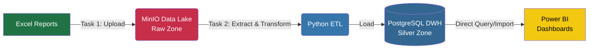

# 🚀 Gỗ Minh Long - End-to-End Data Engineering & BI Project

Đây là một dự án **Học tập & Thực hành (Learning Portfolio)** nhằm mục đích mô phỏng toàn bộ vòng đời của dữ liệu (Data Lifecycle) từ khâu thu thập nguyên liệu thô (Raw Excel) đến khâu trực quan hóa (Power BI Dashboard) trong một doanh nghiệp sản xuất và phân phối (Ngành Gỗ).

Dự án áp dụng các tư duy thiết kế hiện đại như **Data Lake**, kiến trúc **Data Warehouse (Star Schema)**, và **Tự động hóa luồng dữ liệu (ETL Orchestration)**.

---

## 🎯 Mục tiêu dự án
1. Xây dựng một luồng dữ liệu **ETL tự động hoàn toàn (Zero-touch)** để thay thế cho quy trình tổng hợp báo cáo bằng tay cồng kềnh.
2. Xây dựng **Data Warehouse (DWH)** tập trung, làm Single Source of Truth cho toàn bộ công ty.
3. Học và áp dụng thực tế các công cụ Data Stack hiện đại: **Docker, Airflow, MinIO, PostgreSQL**.
4. Thiết kế Dashboard Quản trị tài chính và Bán hàng chuyên nghiệp trên **Power BI**.

---

## 🏗️ Kiến trúc hệ thống (Architecture)

Hệ thống được thiết kế theo tư duy **Medallion Architecture** (chia lớp dữ liệu) nhưng được tối ưu gọn nhẹ cho quy mô doanh nghiệp vừa:

### 1. Nguồn dữ liệu (Data Sources)
- Báo cáo kết xuất từ hệ thống phần mềm kế toán (MISA).
- File Excel nhập liệu thủ công từ các phòng ban.

### 2. Data Lake (MinIO)
- Đóng vai trò làm **Raw Zone**.
- Toàn bộ file Excel được ném vào đây làm bản sao lưu an toàn tuyệt đối. Nếu DWH có sập, dữ liệu vẫn còn nguyên ở MinIO để chạy lại luồng.

### 3. ETL Pipeline (Python + Airflow)
- **Luồng 1 (Upload):** Tính toán mã băm MD5 của file Excel để kiểm tra xem file có thay đổi hay không. Nếu không đổi -> Bỏ qua để tiết kiệm tài nguyên. Nếu đổi -> Đẩy lên MinIO.
- **Luồng 2 (Load):** Python chui vào MinIO đọc file, làm sạch rác (lọc null, chuẩn hóa kiểu dữ liệu, tra cứu khóa ngoại `dim_bank`), và nạp thẳng vào DWH.
- **Điều phối (Orchestration):** Apache Airflow được dùng để lập lịch chạy tự động lúc nửa đêm.

### 4. Data Warehouse (PostgreSQL)
- Schema `silver` chứa toàn bộ dữ liệu đã được làm sạch.
- Mô hình dữ liệu được thiết kế chuẩn **Star Schema** với các bảng Fact (Giao dịch, Dòng tiền) và bảng Dim (Khách hàng, Sản phẩm, Ngân hàng).

---

## 🛠️ Công nghệ sử dụng (Tech Stack)

* **Ngôn ngữ xử lý:** Python 3 (Pandas, SQLAlchemy).
* **Cơ sở dữ liệu (Database):** PostgreSQL 16.
* **Lưu trữ đối tượng (Object Storage):** MinIO (Amazon S3 Clone).
* **Điều phối luồng (Orchestrator):** Apache Airflow.
* **Ảo hóa hạ tầng (Infrastructure):** Docker & Docker Compose.
* **Trực quan hóa (BI):** Microsoft Power BI.

---

## 🧠 Những bài học kinh nghiệm (Key Learnings)

Thông qua dự án này, mình đã rút ra được những bài học quý giá:
- **Tư duy thiết kế Cấu trúc Dữ liệu:** Không phải cứ nhét hết vào 1 bảng là xong. Việc tách Fact/Dim giúp truy vấn cực kỳ nhanh và chuẩn hóa được Master Data.
- **Cơ chế Rollback dữ liệu:** Hiểu được tầm quan trọng của việc "quay xe". Pipeline được thiết kế để có thể dễ dàng xóa dữ liệu của ngày hôm nay và nạp lại ngày hôm qua nếu phát hiện sai sót, không sợ ghi đè hỏng Data.
- **Sức mạnh của Docker:** Tự tay triển khai toàn bộ hệ thống (Database, MinIO) trên Docker chỉ bằng 1 câu lệnh, không sợ lỗi "Máy tôi chạy được nhưng máy bạn thì không".
- **Biến Logic kinh doanh thành Code:** Chuyển đổi thành công hàng tá quy tắc kế toán phức tạp thành các dòng code Python tự động hóa 100%.

---
*Dự án này là minh chứng cho quá trình tự học hỏi và nâng cao kỹ năng Data Engineering.*
