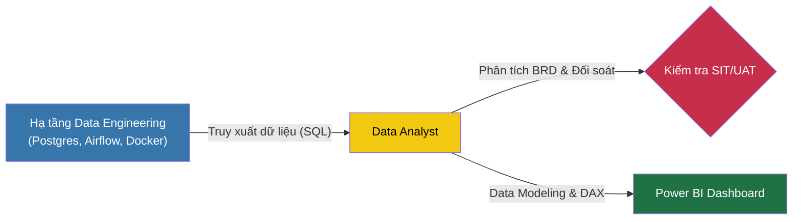

# 📊 Gỗ Minh Long - Data Analytics & Business Intelligence Portfolio

Đây là một dự án **Học tập & Thực hành (Learning Portfolio)** dưới góc nhìn của một **Data Analyst (DA) / BI Developer**. 

Trọng tâm của dự án là việc khai thác hạ tầng dữ liệu có sẵn (Data Warehouse) để phân tích, đối soát logic kinh doanh phức tạp (Tài chính, Bán hàng, Kho) và xây dựng hệ thống báo cáo quản trị (Dashboard) chuyên nghiệp trên Power BI cho một doanh nghiệp ngành Gỗ.

---

## 🎯 Vai trò và Mục tiêu của Data Analyst trong dự án

Trong dự án này, với tư cách là một DA, mình tập trung giải quyết các bài toán sau:
1. **Business Logic & Validation:** Phân tích quy tắc nghiệp vụ (BRD) phức tạp của ngành gỗ và đối soát tính chính xác của dữ liệu (SIT/UAT) giữa số liệu kế toán và dữ liệu trên hệ thống.
2. **Data Modeling (Power BI):** Kéo dữ liệu từ Data Warehouse (được tổ chức sẵn theo chuẩn Star Schema) vào Power BI, thiết lập quan hệ (Relationships) chuẩn xác giữa các bảng Fact và Dim.
3. **DAX & Analytics:** Viết các biểu thức DAX phức tạp để tính toán các chỉ số tài chính, vòng quay hàng tồn kho, công nợ.
4. **Data Storytelling:** Thiết kế Dashboard trực quan, thân thiện với người dùng cuối (BOD) để hỗ trợ ra quyết định.

---

## 🏗️ Hạ tầng dữ liệu được sử dụng (The Infrastructure)

Mặc dù trọng tâm là phân tích dữ liệu, mình cũng đã học cách **vận hành và khai thác** hệ thống Data Engineering (DE) cực kỳ hiện đại được xây dựng sẵn cho dự án để tự phục vụ nhu cầu lấy số liệu:

* **PostgreSQL (Data Warehouse):** Nơi mình trực tiếp viết các câu lệnh SQL để truy vấn, đối chiếu và kiểm tra dữ liệu từ schema `silver`.
* **Apache Airflow & Python (ETL):** Mình biết cách theo dõi luồng dữ liệu, kích hoạt (trigger) các tiến trình nạp/hủy dữ liệu trên giao diện Airflow để đảm bảo Data Warehouse luôn có số liệu mới nhất trước khi đưa lên báo cáo.
* **Docker & MinIO:** Sử dụng Docker để tự khởi tạo môi trường Data giả lập (Local Environment) ngay trên máy cá nhân nhằm mục đích nghiên cứu, đối soát file báo cáo gốc trên Data Lake (MinIO) mà không sợ ảnh hưởng đến môi trường Production.

---

## 🧠 Những bài học kinh nghiệm (Key Learnings của một DA)

Thông qua dự án này, kỹ năng Phân tích dữ liệu của mình đã được nâng cấp đáng kể:
- **Tư duy kết hợp DA & DE:** Hiểu được luồng đi của dữ liệu từ file Excel thô qua ETL vào đến Database giúp mình chủ động hơn rất nhiều. Khi số liệu trên Dashboard bị sai, mình biết cách tự trace (truy vết) ngược lại Data Warehouse hoặc File gốc để tìm ra nguyên nhân thay vì chỉ phụ thuộc vào Data Engineer.
- **Xử lý dữ liệu tài chính phức tạp:** Làm quen với các khái niệm khó nhằn như Dòng tiền (Cashflow), Công nợ (Receivables), Tồn kho (Inventory) và cách áp dụng công thức DAX để giải quyết.
- **Tối ưu Data Model:** Hiểu sâu sắc giá trị của Star Schema (Bảng Fact / Bảng Dim). Nhờ dữ liệu đã được làm sạch và chia lớp từ tầng Database, việc dựng mô hình trên Power BI trở nên vô cùng nhẹ nhàng và tối ưu hiệu suất.
- **Viết tài liệu nghiệp vụ (BRD):** Nâng cao kỹ năng chuyển ngữ từ ngôn ngữ kinh doanh (Business) sang ngôn ngữ kỹ thuật (Tech) qua cuốn cẩm nang phát triển báo cáo (Development Guide).

---
*Dự án này là minh chứng cho định hướng phát triển của mình: Một Data Analyst không chỉ giỏi vẽ biểu đồ, mà còn hiểu sâu về nghiệp vụ kinh doanh và hệ thống dữ liệu ngầm.*
